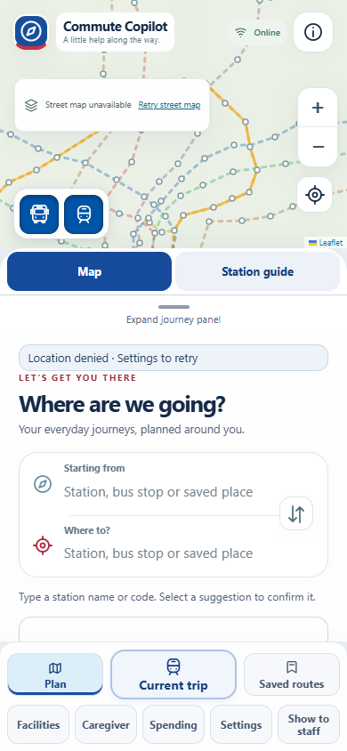
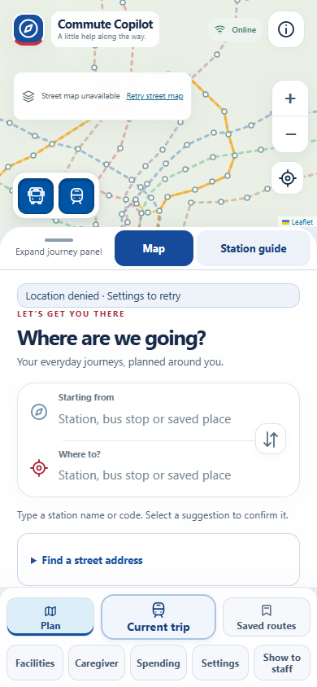
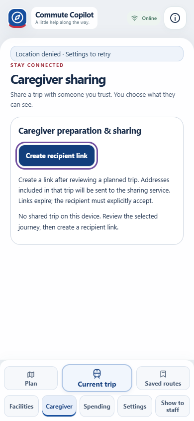
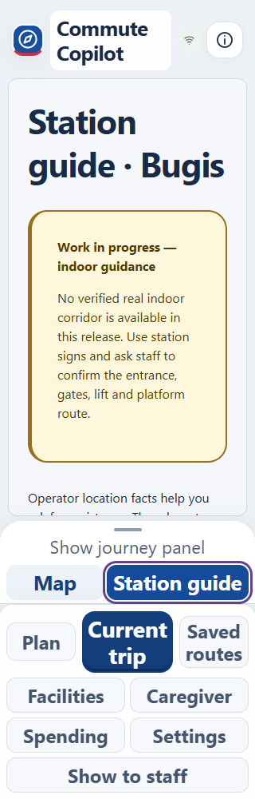

# FR2 polish delivery — items 3, 4, 5, 7

Base: `f78882b` (public FR2 v6). Branch: `codex/fr2-polish`.

- Removed the requested “Latest checkpoint and optional latest position” and “Ordinary Web Push is optional” paragraphs from Caregiver. Kept recipient acceptance, address disclosure, permissions, retention implementation and notification controls unchanged.
- Fixed the dark text inherited by Create recipient link after its panel moves outside `.copilot`. White text now has 7.93:1 default contrast, 10.47:1 hover/focus and 14.27:1 pressed contrast; keyboard focus remains visible.
- Aligned panel/heading spacing, removed the extra top margin from companion headings, compacted Current/Saved empty states, tightened nearby service spacing, and removed the empty staff status spacer. Text sizes and touch targets remain intact.
- Integrated the resize handle and Map/Station guide tabs into `.journey-sheet-header`. At 390px the header is 53px versus the previous 97px: 44px more content in normal position and 44px more map when compact. It wraps at 200% text. The sheet measures the actual header height so compact placement remains directly above navigation.

## Integration interfaces

`src/commute-ui.js` changes only the main panel's header markup. Existing IDs, tab roles, control handlers and route events remain unchanged. `src/journey-sheet.js` measures/observes the new wrapper, retaining a fallback for the previous markup. `src/r5.css` appends the responsive header and shared spacing rules. Nearby service rules target `.nearby-facilities` and `.nf-*`, without depending on the Facilities label or navigation key; retain those classes through the parallel Services rename. `src/commute.css` changes one existing primary text-color declaration. `src/copilot-ui.js` changes only the two requested paragraphs.

No route search, replay behavior, shared Git configuration, deployment or merge changes.

## Validation

Run from this worktree with `TEST_BASE_URL=http://127.0.0.1:4242` and installed Edge via `BROWSER_EXECUTABLE`:

- `npm ci --offline`, `npm run build`, `npm test`: passed (454 unit tests).
- `node tests/fr2-polish-browser.mjs`: passed (69 checks across all eight tabs at 320px, 390px, desktop, and 200% root text). Checks viewport/content overflow, focus, navigation clearance, header space, caregiver copy, button contrast and keyboard station-page selection.
- `node tests/r5-journey-sheet-browser.mjs`: passed (39 checks). Touch drag, cancellation, native scrolling, mouse drag, keyboard positions, compact inertness, station-guide scrolling, accepted-journey preservation and desktop behavior.
- `node tests/r5-guidance-browser.mjs`: passed. Includes horizontal touch on the integrated tabs and 320px/200% text.
- `node tests/pre-fr2-staff-tick-browser.mjs`: passed, including large text and keyboard behavior.
- Syntax checks for all changed JS and `git diff --check`: passed.

Actual screenshots were inspected. Selected evidence is committed in `docs/evidence/fr2-polish/`; complete screenshots and JSON measurements are generated under `test-results/fr2-polish/after/`. Before screenshots used the unmodified v6 build. Tests use explicitly labelled local journey fixtures and block street-map tiles for deterministic rendering. No physical phone, screen-reader, live-provider or notification-delivery validation is claimed.

| Before | After |
| --- | --- |
|  |  |

