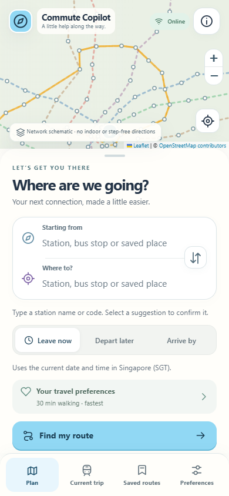
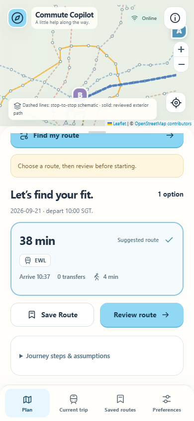
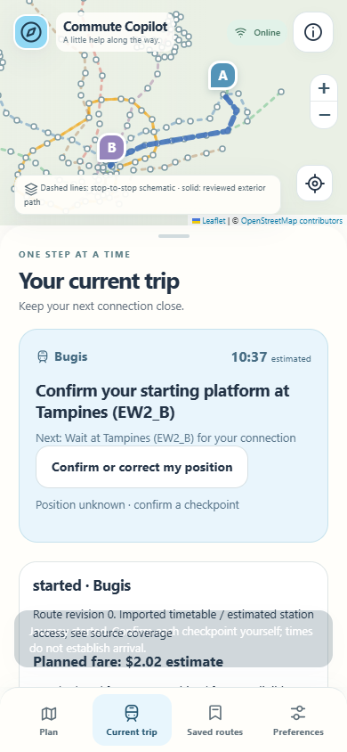
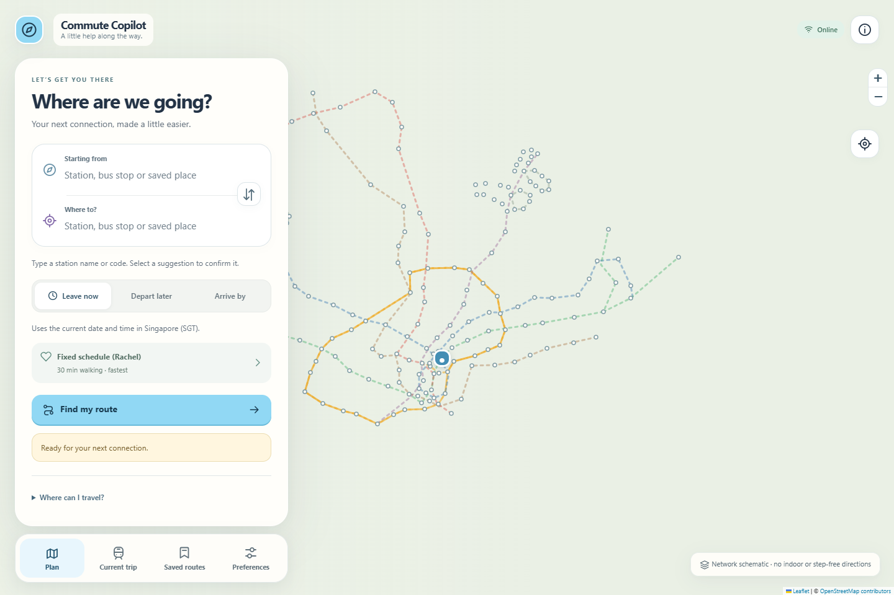

# Features R2 — one map-led Commute Copilot

R2 integrates the user-feedback brief with a Waze-inspired search → compare → review → start flow. The visual language uses original rounded SVG icons, powder blue, mint and lavender accents, large touch targets, a map that stays visible, and an independently scrolling trip sheet. The interface remains a public-transport product with explicit evidence limits.

## Product changes

- **Plan / Current trip / Saved routes / Preferences** are the four primary sections. `/`, `/rail.html` and `/multimodal.html` enter the same application. The original planners remain available with `?legacy=1` for historical regression evidence; `/replay.html` is the labelled Demo.
- Typed endpoint suggestions support keyboard arrows/Enter, touch, rail station aliases (including EW2/DT32 and EW12/DT14), pilot bus codes and directions, and saved places. Unresolved addresses remain unresolved. The real imported routing engines cover endpoints beyond the three-station replay.
- Leave now uses the actual Singapore civil date/time. Depart later and optional Arrive by include date context, direct keyboard entry and an optional scrollable hour/minute picker. Arrive by is clearly deadline filtering from the chosen departure, not a latest-departure optimizer.
- Rachel, Arjun and Mdm Lim apply disclosed, editable preference presets. Preferences survive reload, saving and sharing. Timetable riding durations never change by persona; no appointment deadline is inferred. Mdm Lim does not acquire a verified accessible route from a label.
- Save Route creates a reusable endpoint/preference pair atomically; repeat names receive distinct labels. Reopening chooses fresh departure timing while retaining explicit saved deadline choices for review. Prior snapshot bytes are preserved during migration.
- Start Journey creates one canonical active trip. Navigation, previewing another route, offline reload, reconnects and explicit revisions preserve the journey identity. The current card shows natural-language current/next actions and a reachable manual correction button.
- Local foreground location assistance is explicitly opt-in and independent of both caregiver permissions. Hiding, pausing, ending or explicitly stopping prevents collection until the user enables it again. Offline connectivity alone does not stop an otherwise usable fix. GPS never confirms boarding, a floor, transfer or arrival.
- Offline readiness checks the current service-worker shell and exact durable accepted-trip state. Missing assets, worker changes and failed/removed storage withdraw the readiness claim. Saved time and removal controls distinguish today’s guidance from reusable routes.
- Rerouting reuses the original confirmed-progress comparison logic. Walking already completed remains part of the total budget. A revision after boarding requires full fare reassessment instead of treating a remaining-leg fare as the entire journey.
- Fictional incidents belong to Demo. A planned timetable route can be started as a separately labelled rehearsal, with independent expenditure accounting.

## Maps and coverage

The background network diagram uses imported station/stop coordinates. Dashed links are explicitly labelled schematic, never actual tracks or walking paths. Solid exterior paths use existing reviewed pedestrian waypoints. OpenStreetMap tiles are available online when the tile service is reachable; the schematic and text guidance remain useful without them.

Verified continuous real accessible indoor routing and verified real toilet-routing coverage remain unavailable. Crowding, shelter, underground floor matching, live LTA credentialed access, deployed sharing/D1, external push delivery and physical iPhone/Android testing are not claimed as verified. User-selected deadlines, manual progress and reviewed route acceptance remain authoritative.

## Review and operation

The R2 branch is based on merged R1 `main` at `69cb5aad3f72074c735e271aff64d01029b2aa0f`, whose tree matches tested R1 `558a899`. R1 history is preserved. No deployment, audience expansion or production settings are part of this change.

```sh
npm ci
npm run check
npm run dev
```

New browser checks: `npm run test:r2-browser` (set `TEST_BASE_URL` to the running local server) and `npm run test:location-offline-browser`. Use `BROWSER_EXECUTABLE` to select installed Edge/Chromium. Verification details, counts and build hashes are in [R2_VERIFICATION.md](R2_VERIFICATION.md). Desktop mobile emulation is recorded separately from untested physical phones.

The original Waze references were its official [destination-search flow](https://support.google.com/waze/answer/6262563?hl=en) and [alternative-route flow](https://support.google.com/waze/answer/6262424?hl=en). Icons, branding and transit controls here are original application assets.

## Screenshots

| Plan | Compare | Current trip |
| --- | --- | --- |
|  |  |  |


