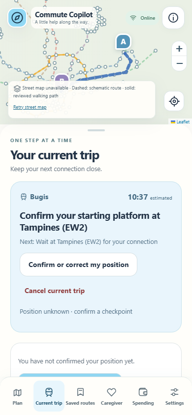
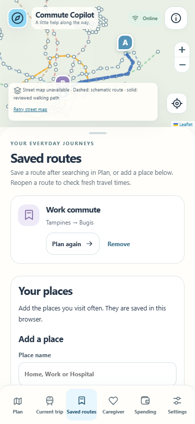

# Features R3 — a clearer everyday travel companion

R3 addresses the twelve fixes requested on 19 September 2026. The application is based on merged R2 and its release record at `5b089bb9cfb09ec5df4fa314f3fb2b55074d8e55`, in the isolated `codex/features-r3` branch. The user's requests define the scope; the prior handoff provides baseline context.

## Requested changes

| Request | Result |
| --- | --- |
| Top-left icon and loading screen | Home returns to Plan without reloading the document or losing the current trip. First load has a quiet branded state. |
| Cancel current trip | A visible action on the trip card opens a Keep / Cancel choice. Cancellation stops local guidance/location and further sharing updates, persists across reload, preserves saved routes and creates no completed-trip spending. Deferred server privacy changes retry after reconnect. |
| Singapore map coverage | OpenStreetMap has geographic data across Singapore. Tile referrers now follow its policy. HTTP errors are checked before displaying image bytes, including valid error images returned with HTTP 403. Failure leaves a labelled network schematic and an explicit Retry action. |
| Remove persona names | Travel-style choices describe fixed schedules, flexibility and accessibility without personal names. Existing stored preferences remain compatible. |
| Clarify route saving | Search, choose Save route, name it, then receive a named confirmation and a View saved routes action. Saved routes reopen with fresh departure timing; there is one route list. |
| Clarify Current trip | Current and next steps are prominent. Fare assumptions, source details and offline controls sit in a descriptive disclosure. Completed/cancelled trips show their ended status without obsolete action prompts. |
| Keep station layouts and toilets | Existing Station layout, Find a toilet and station guidance remain available, with their existing real-coverage and fixture labels. |
| Separate Caregiver and Spending | Each has its own navigation destination and page, reusing its existing controller and data. |
| Clarify connection checks | Position-and-route checks explain when to use them, use walking minutes, and appear only for a supported active trip. They retain explicit time/position confirmation and accepted-route safeguards. |
| Add places by address | An explicit address search returns selectable Singapore matches. Coordinates are no longer entered by the user. The UI explains that the submitted address goes to Photon; the personal label stays local. |
| Remove legacy station clutter | Your places displays deliberately saved places; legacy records and automatic route endpoints are hidden. Older records remain exportable. |
| Remove imported rail journeys | Automatically imported rail/offline templates are hidden without deleting the original records. Deliberately saved routes remain visible. |

## Organiser FAQ: regular-day usefulness first

The organiser's response frames the product as a tailored travel companion for ordinary commuters, with disruption assistance as one situation it should handle. R3's Plan copy, familiar places, reusable routes, adjustable travel styles, understandable current guidance, optional caregiver help and spending history support that regular-day reason to return. Disruption controls do not become the main product.

Timetable choices and explicit departure-time controls support travellers who can vary their schedule. The app does **not** claim that a later train has spare capacity, that a route is less crowded, or that moving demand earns a reward. Demonstrating demand/supply matching with crowding forecasts, incentives or recommended shifts needs dependable supply/demand evidence and a separately defined feature; the FAQ is not treated as proof those capabilities exist.

## Practical boundaries

- A map or address match does not establish a supported door-to-door route, station entrance, indoor floor or step-free connection. Saved address candidates retain unknown routing/accessibility rather than being silently snapped to a station.
- Photon and OSM are online, best-effort services. Searches are explicit, throttled, cached within the page session and cancellable; external map tiles are not bulk-downloaded or promised offline.
- Cancelling locally does not revoke an existing caregiver link. Pending server changes are identified and retried; online access can be removed from the Caregiver page.
- Real verified indoor/toilet coverage, continuous accessible paths, live crowding, native phone behavior and external push delivery retain the baseline's documented limits.

Map sources, provider terms and live checks are in [R3 map coverage](R3_MAP_COVERAGE.md). Test evidence and local preview instructions are in [R3 verification](R3_VERIFICATION.md).

## Review screenshots

The screenshots deliberately exercise map-provider failure: the network schematic stays usable instead of showing access-denied image tiles.
