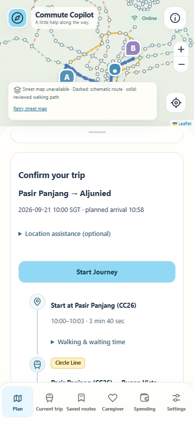
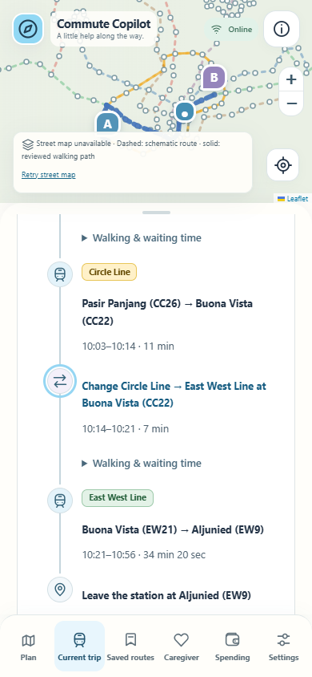

# Features R4 delivery

R4 starts from verified R3 commit `20513f636f2db339f9a02c1a6f1297d9ea8516bf` on `codex/features-r4`, in the isolated application worktree `The-Rail-Pathfinders-r4`. It preserves R3 history and the existing R2/R3 checkouts. The separate Neblala wrapper was not initialized, committed or pushed.

## Compatibility repair before UX work

The R3 release blocker is repaired in `3349faf12039bf526d8841054d1103ca7a891375`. An older bookmark without `savedVia` stays visible when a timestamped route references it; a visible reused endpoint gains explicit user provenance. Explicit migration records and new automatic endpoints remain hidden. Reading old records does not rewrite them.

Follow-up `7be62c791325a6d131d98a59531dd79c2247d64b` also preserves a visible ambiguous bookmark when its deliberate route is deleted but an imported route still references it. Upgrade, reuse, route deletion and reload are covered. No older data was deleted to achieve this.

## Eleven requested changes

| Requirement | Delivered behavior |
| --- | --- |
| Station metadata | Each public station code appears once; distinct interchange codes remain available. Routing IDs are unchanged. |
| Bus directions | Stop names/codes no longer repeat internal `bus:` IDs. Termini use explicit service metadata, not sampled segment ends. Service 23 is accurately described as a Tampines loop via Rochor Canal Road. |
| Time picker | One displayed-time/clock button opens the scroll picker. Apply, Cancel, Escape, keyboard navigation and focus return work for departure and arrival; hidden backing values retain Singapore civil-time/saved timing semantics. |
| Route errors | Diagnostic-supported date, bus coverage, walking and deadline feedback explains what to try. Unresolved failures do not claim a specific cause or the absence of a real-world route. |
| Current-step choices | Readable grouped choices map to original canonical indices. Genuine interchanges remain selectable. No boarding, alighting or route progress is inferred. |
| Transit timeline | Public line badges, transport icons, stop names, times/durations and real transfers replace raw itinerary lists in planning, confirmation, current details and shared invitations. Waiting/access details remain available without duplicating primary rows. |
| I am here | A successful checkpoint focuses current guidance and scrolls `.panel-scroll` to its top, respecting reduced motion. A failed confirmation does not change progress or scroll. |
| Spending | Spacious period headers show normal-weight pending counts beside totals and individual transactions underneath. Today opens; week/month start collapsed. Editors stay scoped to one period/record even when a trip appears in overlapping periods. |
| Confirm your trip | One confirmation section consumes authoritative preferences; duplicate step-free/fare widgets are removed. Start clears stale confirmation, invalid selection clears preparation, and finishing one trip restores an already prepared next trip. Legacy saved preferences and offline/shared plans remain compatible. |
| Station/toilet tools | Toilet controls are consolidated within Station layout & toilets. Real evidence gates, fixture rehearsal and the complete accepted-detour lifecycle remain. Caregiver link creation is on Caregiver and cannot overwrite an existing pending privacy session. |
| Progressive disclosure | Route sources, optional location, fare detail and history tools use disclosures. Work-in-progress coverage banners are visually distinct. Current-trip shortcuts and navigation remain usable with large text; Start is near the confirmation heading. |

Integration review also caught a document-wide Saved routes delete selector that could replace a fare row's handler, and a legacy sticky-form focus rule that could move Find journeys between pointerdown and pointerup. Both are fixed and covered by actual browser actions.

## Verification and practical limits

See [R4 verification](R4_VERIFICATION.md) for tests and build identities. Imported source data and hashes are unchanged. Journey identity, canonical routing indices, cumulative walking, fare replacement/tombstones, explicit sharing consent, offline privacy retries, and HTTP-403 tile gating are retained.

The review against Google Maps, with a separate account of missing data and obtainable integrations, is in [R4 product review](R4_PRODUCT_REVIEW.md). This release improves the interface; it does not expand real indoor/toilet coverage, peak/weekend bus support, live crowding, fare-card access or verified physical-device behavior. Production deployment and audience expansion are outside this change.

